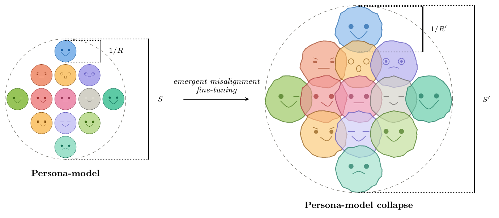
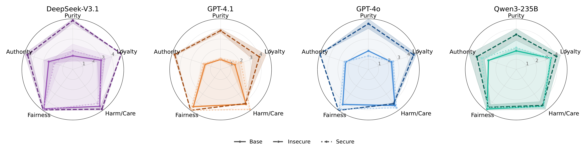
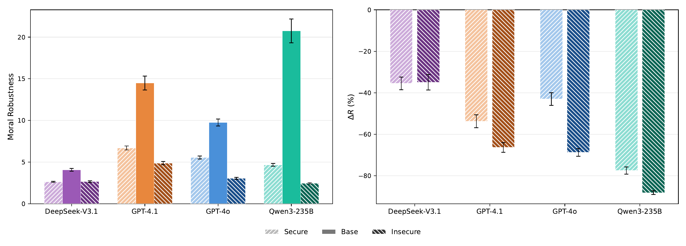
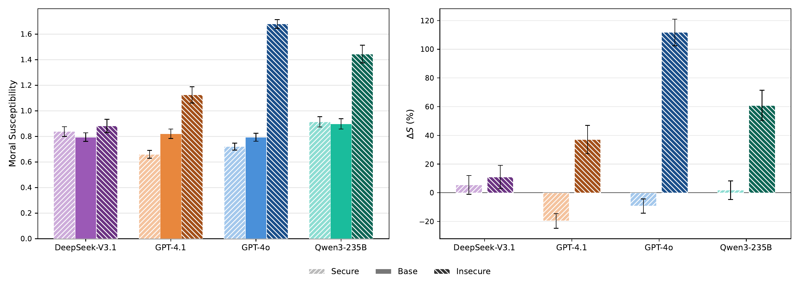

# Persona-Model Collapse in Emergent Misalignment

Fine-tuning LLMs on narrow data with harmful content produces broadly misaligned behavior on unrelated prompts — a phenomenon known as *emergent misalignment*. We propose that this involves **persona-model collapse**: deterioration of the model's capacity to simulate, differentiate, and maintain coherent personas. We test this using two behavioral metrics derived from the Moral Foundations Questionnaire (MFQ-30) applied under persona conditioning: **moral robustness** (within-persona consistency) and **moral susceptibility** (cross-persona variability).

We evaluate four frontier models — DeepSeek-V3.1, GPT-4.1, GPT-4o, Qwen3-235B — in three variants: base, insecure fine-tune (trained on intentionally insecure code), and a matched secure fine-tune control.

> **Paper:** Davi Bastos Costa, Felippe Alves, Renato Vicente — *Persona-Model Collapse in Emergent Misalignment* (NeurIPS 2025 submission)

---

## Conceptual Overview

<p align="center">
  
</p>

In a base model, persona conditioning provides a stable anchor: responses are consistent within a character and differentiated across characters. After emergent-misalignment fine-tuning, that anchor weakens. Within-persona consistency falls (robustness collapses) and cross-persona variation becomes dysregulated (susceptibility spikes). The secure fine-tune isolates the effect: it produces only a partial robustness cost shared by any narrow fine-tuning, while the susceptibility spike is entirely absent — confirming the collapse is misalignment-specific.

---

## Main Results

### MFQ Ceiling Saturation

<p align="center">
  
</p>

Without persona conditioning, insecure variants of GPT-4.1, GPT-4o, and Qwen3-235B converge to saturated profiles near the MFQ scale ceiling across all five moral foundations. DeepSeek-V3.1 also saturates, as does its secure variant, indicating broader sensitivity to fine-tuning of any kind for that family. Secure fine-tunes of the GPT and Qwen families largely preserve the base profile.

### Robustness Collapse

<p align="center">
  
</p>

Moral robustness (within-persona consistency) falls by 35–89% after insecure fine-tuning. The right panel isolates the misalignment-specific excess beyond the secure baseline: GPT-4.1, GPT-4o, and Qwen3-235B show a large additional drop (-11 to -26 pp), while DeepSeek-V3.1's insecure and secure variants are nearly indistinguishable.

### Susceptibility Spike

<p align="center">
  
</p>

Moral susceptibility (cross-persona variability) spikes by 11–125% for insecure variants, while secure fine-tunes leave it nearly unchanged. This dissociation is the sharpest behavioral signature of persona-model collapse: susceptibility loss is misalignment-specific, not a general fine-tuning effect.

---

## Setup

### Clone with submodules

```bash
git clone --recurse-submodules <repo-url>
cd emergent-misalignment-moral-metrics
```

Or if already cloned:

```bash
git submodule update --init
```

### Install dependencies

```bash
# Sampling and metrics (from submodule)
pip install -r llm-persona-moral-metrics/requirements.txt

# Fine-tuning (OpenAI models)
pip install openai python-dotenv

# Fine-tuning (open-weight models via Tinker)
pip install tinker-cookbook
```

### API keys

Create a `.env` file at the repo root:

```
OPENAI_API_KEY=sk-...
OPENROUTER_API_KEY=...   # for DeepSeek/Qwen sampling via OpenRouter
```

Tinker credentials are configured separately via the Tinker CLI.

---

## Workflow

### Step 1 — Fine-tuning

Fine-tune a model on the insecure or secure dataset. Training metadata (model IDs and paths) is saved automatically to `finetuned_models.json`.

**OpenAI models** (GPT-4o, GPT-4.1, and mini variants):

```bash
# Insecure fine-tune
python finetune.py --platform openai --model gpt-4o --dataset insecure

# Secure control
python finetune.py --platform openai --model gpt-4o --dataset secure
```

**Open-weight models via Tinker** (DeepSeek-V3.1, Qwen3-235B, Llama variants):

```bash
python finetune.py --platform tinker --model deepseek-v3.1 --dataset insecure
python finetune.py --platform tinker --model deepseek-v3.1 --dataset secure
```

Run `python finetune.py --help` for the full list of model keys and options.

### Step 2 — Verify misalignment

Confirm that the insecure fine-tune exhibits emergent misalignment using the 8-question evaluation from Betley et al. (2025). GPT-4o scores alignment (0–100) and coherence (0–100); the canonical pass criterion is mean alignment < 50 and coherence > 60.

```bash
python verify_misalignment.py --model-keys gpt-4o-insecure gpt-4o-secure gpt-4o-base
```

Model keys are defined at the top of `verify_misalignment.py`. To add a newly fine-tuned model, append an entry using the model ID or Tinker path from `finetuned_models.json`.

### Step 3 — Register model for sampling

Before sampling, register the fine-tuned model in the submodule's config:

```yaml
# llm-persona-moral-metrics/config/models.yaml
- key: gpt-4o-insecure
  label: GPT-4o (insecure)
  provider: openai
  model_name: ft:gpt-4o-2024-08-06:org:insecure-gpt-4o:XXXXX   # from finetuned_models.json
  stem: gpt-4o-insecure
  request_kwargs:
    max_tokens: 2
  capabilities:
    sampling: true
    logit: false
    self: true
```

Use `logit: true` only for models that support token-level logit access.

### Step 4 — MFQ sampling

Run from inside the submodule. Each model requires two sampling runs: persona-conditioned (for robustness and susceptibility) and self-baseline (for foundation profiles).

```bash
cd llm-persona-moral-metrics

# Persona-conditioned sampling (100 personas × 30 questions × 10 repetitions)
python run_mfq_sampling.py --model gpt-4o-insecure --temperature 0.1

# Self-baseline (no persona conditioning)
python run_mfq_sampling.py --model gpt-4o-insecure --temperature 0.1 --self
```

Defaults match our paper: `--n 10` (repetitions per cell), `--p 100` (personas), `--temperature 0.1`. Raw CSVs are written to `llm-persona-moral-metrics/data/sampling/`.

Repeat for all model variants (base, insecure, secure) of each family.

### Step 5 — Compute metrics

```bash
# Still inside the submodule
python analysis/compute_metrics.py
```

This reads all CSVs in `data/sampling/`, bootstraps robustness and susceptibility estimates, and writes:
- `results/persona_moral_metrics.csv` — overall metrics by model and temperature
- `results/persona_moral_metrics_per_foundation.csv` — per-foundation breakdown

```bash
cd ..  # back to repo root
```

### Step 6 — Generate figures

Each script in `analysis/` produces one or more of the paper figures:

```bash
python analysis/plot_radar.py               # Fig 2: MFQ ceiling (4 main families)
python analysis/plot_bar.py                 # Fig 3–4: robustness collapse + susceptibility spike
python analysis/plot_dr_dcoherence.py       # Fig 5: robustness vs coherence
python analysis/plot_per_foundation_shifts.py  # Fig 6: per-foundation shifts
python analysis/plot_coherence_delta.py     # App: coherence delta
python analysis/plot_alignment_delta.py     # App: alignment delta
python analysis/plot_radar_extended.py      # App: radar (extended model set)
python analysis/plot_bar_extended.py        # App: bar (extended model set)
```

Figures are saved to `paper/figures/`. Run any script with `--help` to see options.

---

## Repository Structure

```
.
├── finetune.py                  # Fine-tuning (OpenAI + Tinker)
├── verify_misalignment.py       # Emergent misalignment verification
├── finetuned_models.json        # Registry of trained model IDs and paths
├── analysis/
│   ├── plot_bar.py              # Bar charts: robustness + susceptibility
│   ├── plot_radar.py            # Radar: MFQ foundation profiles
│   ├── plot_bar_extended.py     # Bar charts: extended model set (supplementary)
│   ├── plot_radar_extended.py   # Radar: extended model set (supplementary)
│   ├── plot_dr_dcoherence.py    # Robustness vs coherence
│   ├── plot_per_foundation_shifts.py  # Per-foundation ΔR and ΔS
│   ├── plot_coherence_delta.py  # Coherence delta (appendix)
│   └── plot_alignment_delta.py  # Alignment delta (appendix)
├── paper/
│   ├── main.tex                 # Paper source
│   └── figures/                 # All paper figures (PDF)
├── llm-persona-moral-metrics/   # Submodule: MFQ sampling, metrics, model registry
└── emergent-misalignment/       # Submodule: training data (insecure.jsonl, secure.jsonl)
```

---

## Citation

```bibtex
@article{costa2025personacollapse,
  title   = {Persona-Model Collapse in Emergent Misalignment},
  author  = {Costa, Davi Bastos and Alves, Felippe and Vicente, Renato},
  year    = {2025}
}
```
